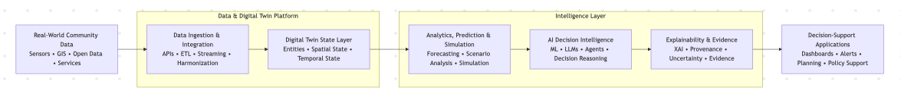

# System Architecture

## Objective

Build a production-oriented community digital twin platform that integrates
real-world data, digital twin state, analytics, simulation, and AI-driven
decision intelligence.

## Architectural Principles

- Real-world data first
- Modular and interoperable
- Evidence-grounded AI
- Explainable decision support
- Human-in-the-loop
- Reproducible research
- Production-oriented engineering
- Cloud deployable
- Transferable across communities

## Initial Logical Architecture

## Initial Case Study

Burnaby, British Columbia, Canada.

## Status

The architecture will evolve through implementation, experimentation,
literature review, and doctoral research.